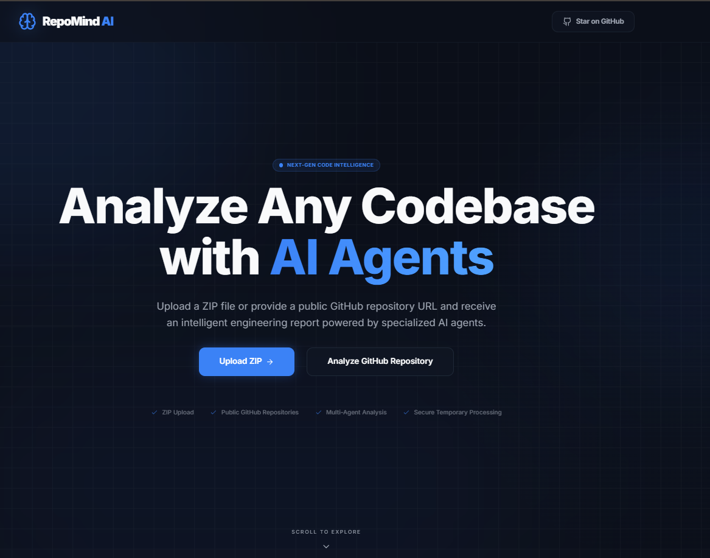

# 🚀 RepoMind AI

**AI-Powered Multi-Agent Engineering Analysis Platform**

> Analyze GitHub repositories or ZIP projects with specialized AI agents to generate architecture reviews, security insights, documentation analysis, engineering action plans, and strategic recommendations.



---

## 🛡️ Tech Stack & Tools


---

## 🌐 Live Demo

Experience RepoMind AI live in production:

*   **Frontend:** [https://repomind-ai-blond.vercel.app](https://repomind-ai-blond.vercel.app) – Deployed on **Vercel**
*   **Backend API:** [https://repomind-ai-backend.onrender.com](https://repomind-ai-backend.onrender.com) – Deployed on **Render**

---

## ✨ Features

*   🤖 **Multi-Agent AI Analysis** – Specialized agents for Code, Security, and Documentation.
*   📦 **ZIP Project Analysis** – Fast processing for local repository uploads.
*   🔗 **GitHub Repository Analysis** – Seamless integration with public GitHub URLs.
*   🏗️ **Architecture Review** – Intelligent assessment of project structure and patterns.
*   🔒 **Security Assessment** – Deep scan for vulnerabilities and security best practices.
*   📚 **Documentation Evaluation** – Analysis of READMEs, comments, and API docs.
*   📋 **Engineering Action Plans** – Actionable steps to improve codebase health.
*   🧠 **Strategic Recommendations** – High-level roadmap for technical debt and features.
*   🌙 **Premium Dark UI** – Modern, high-performance aesthetic designed for engineers.
*   📱 **Responsive Design** – Fully optimized for desktop, tablet, and mobile.
*   ⚡ **Fast Processing** – Optimized repository scanning and context building.
*   🛡️ **Graceful Error Handling** – Clear, user-friendly status updates and fallbacks.

---

## 🏛️ Tech Stack

| Category | Technology |
| :--- | :--- |
| **Frontend** | Next.js 15, React 19, TypeScript, Tailwind CSS 4 |
| **Backend** | FastAPI, Python 3.12 |
| **AI Orchestration** | Google Gemini 1.5 Flash (via `google-genai` SDK) |
| **Deployment** | Vercel (Frontend), Render (Backend) |

---

## 🧩 Multi-Agent Pipeline

The RepoMind AI engine utilizes a multi-stage orchestration pipeline to deliver deep insights:

**Repository / ZIP**
↓
**Preprocessing** (Local metadata extraction & structure analysis)
↓
**Language Detection** (Intelligent categorization of source files)
↓
**AI Agent Collaboration:**
  - 🛠️ **Code Analysis Agent**
  - 🔒 **Security Agent**
  - 📚 **Documentation Agent**
↓
**Planner Agent** (Synthesizes findings into a strategic roadmap)
↓
**Report Builder** (Aggregates data into a unified JSON/Markdown report)
↓
**Engineering Insights** (Delivered via the premium dashboard)

---

## 📸 Screenshots

### Main Dashboard


---

## 📂 Project Highlights

*   **Production-Ready UI:** Highly polished interface with fluid Framer Motion animations.
*   **Metadata Extraction:** Advanced local parsing to minimize LLM token usage.
*   **AI-Assisted Engineering Reports:** Multi-dimensional analysis covering the full SDLC.
*   **Friendly Fallbacks:** Intelligent handling of API quotas and provider downtime.
*   **Clean Architecture:** Highly modular and type-safe codebase.
*   **Modern UX:** Streamlined analysis flow from ingestion to export.
*   **Portfolio Quality:** Built with industry-standard engineering practices.

---

## 🚀 Getting Started

### Prerequisites
*   **Node.js** (v18+)
*   **Python** (v3.9+)
*   **Google Gemini API Key**

### Installation & Local Development

1.  **Clone the repository:**
    ```bash
    git clone https://github.com/karalapatiphanicharan-cyber/repomind-ai.git
    cd repomind-ai
    ```

2.  **Frontend Setup:**
    ```bash
    npm install
    npm run dev
    ```

3.  **Backend Setup:**
    ```bash
    cd backend
    pip install -r requirements.txt
    uvicorn app.main:app --reload
    ```

---

## 🔑 Environment Variables

**Backend (`backend/.env`):**
```env
GOOGLE_API_KEY=your_gemini_api_key_here
```

**Frontend (`.env.local`):**
```env
NEXT_PUBLIC_API_URL=http://localhost:8000
```

---

## ☁️ Deployment

*   **Frontend:** Optimized for deployment on [Vercel](https://vercel.com).
*   **Backend:** Designed for [Render](https://render.com) using the provided `requirements.txt`.

---

## 🛣️ Future Roadmap

*   [ ] **Extended AI Support:** Integration with Claude 3.5 and GPT-4o.
*   [ ] **PDF Export:** High-quality PDF generation for stakeholders.
*   [ ] **CI/CD Bot:** Automated analysis comments on PRs.
*   [ ] **History Dashboard:** Track project health improvements over time.
*   [ ] **Custom Rules:** Domain-specific analysis templates.

---

## 🤝 Contributing

Contributions are what make the open-source community such an amazing place to learn, inspire, and create. Any contributions you make are **greatly appreciated**.

1. Fork the Project
2. Create your Feature Branch (`git checkout -b feature/AmazingFeature`)
3. Commit your Changes (`git commit -m 'Add some AmazingFeature'`)
4. Push to the Branch (`git push origin feature/AmazingFeature`)
5. Open a Pull Request

---

## ⭐ Support

If you find RepoMind AI helpful, please give it a star! It means a lot to the project.

[Star on GitHub](https://github.com/karalapatiphanicharan-cyber/repomind-ai)

---

© 2025 RepoMind AI – Empowering engineers with intelligent analysis.
